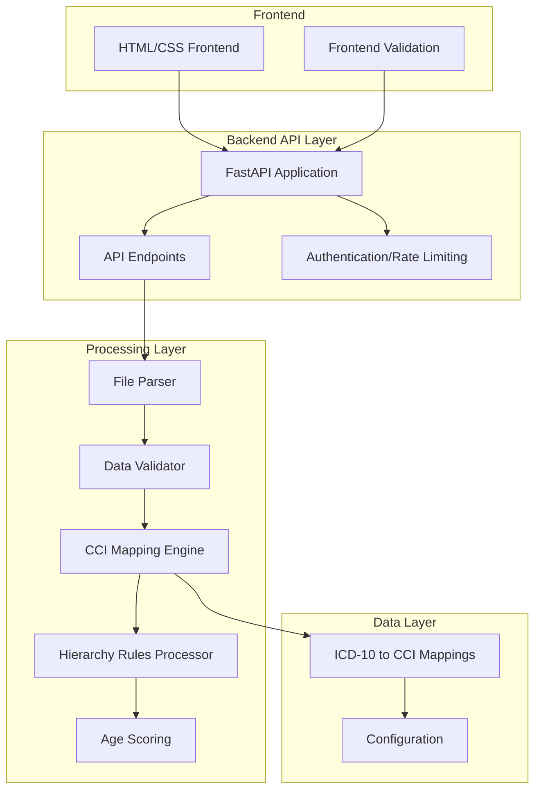
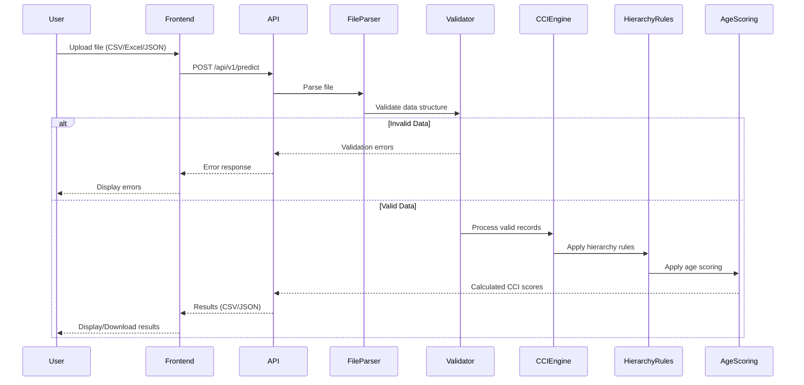
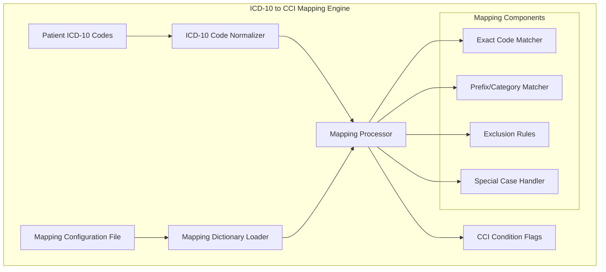
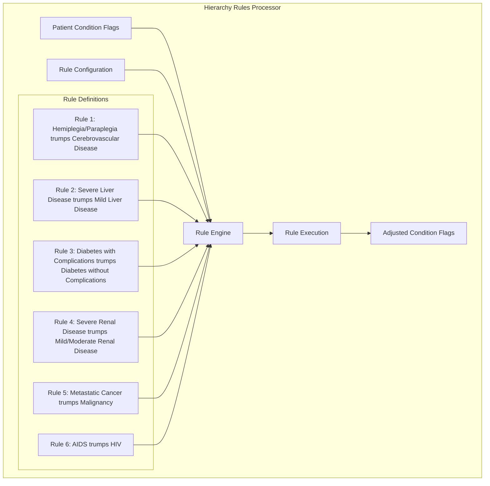
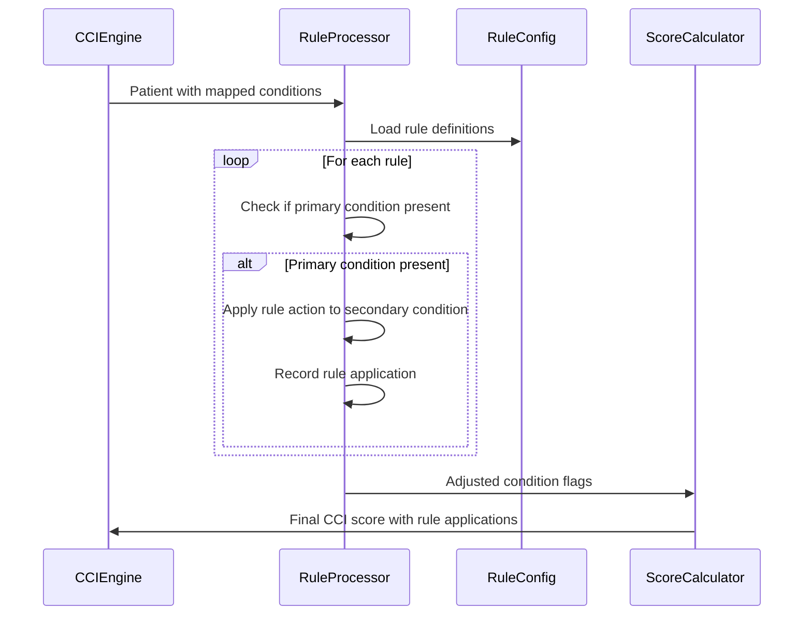
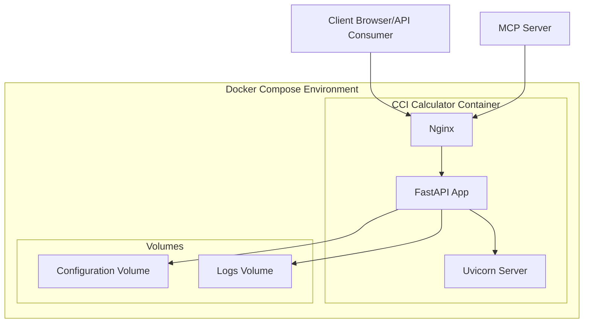

# CCI Calculator System Architecture

## 1. High-Level Architecture Overview



## 2. Component Details

### 2.1 Frontend Layer
- **HTML/CSS Frontend**
  - Simple, responsive web interface
  - File upload form with format selection
  - Legal disclaimer display
  - Results display/download section
  - Error messaging component
  - Future: Optional React/TypeScript upgrade

- **Frontend Validation (Future Enhancement)**
  - Client-side file format validation
  - Basic schema validation before upload
  - File size limits enforcement

### 2.2 Backend API Layer
- **FastAPI Application**
  - Core application server
  - Request handling and routing
  - Response formatting
  - Error handling and logging

- **API Endpoints**
  - `POST /api/v1/predict` - Main endpoint for file upload and processing
  - `GET /api/v1/health` - Health check endpoint
  - `GET /api/v1/info` - API information and version
  - Future: `GET /api/v1/mappings` - Endpoint to retrieve current mappings

- **Authentication/Rate Limiting**
  - Basic API key authentication (optional)
  - Rate limiting to handle concurrent requests (50 concurrent users)
  - Request throttling for large file uploads

### 2.3 Processing Layer
- **File Parser**
  - Multi-format support (CSV, Excel, JSON)
  - Streaming parser for large files
  - Format detection and conversion to internal representation

- **Data Validator**
  - Pydantic models for schema validation
  - Required field validation (patient ID, age/DOB)
  - ICD-10 code format validation
  - Error collection and reporting

- **CCI Mapping Engine**
  - Core mapping logic from ICD-10 to CCI categories
  - Configurable mapping dictionary
  - Efficient lookup mechanism for large datasets

- **Hierarchy Rules Processor**
  - Implementation of 6 explicit hierarchy rules
  - Rule prioritization and conflict resolution
  - Validation of rule application

- **Age Scoring**
  - Age calculation from DOB and entry date if needed
  - Age-based score adjustments
  - Age validation

### 2.4 Data Layer
- **ICD-10 to CCI Mappings**
  - Structured mapping dictionary
  - Based on Glasheen et al. 2019 CDMF CCI system
  - Versioned and updatable

- **Configuration**
  - Application settings
  - Mapping configuration
  - Performance tuning parameters

## 3. Data Flow



## 4. ICD-10 to CCI Mapping Engine (Detailed)

The ICD-10 to CCI Mapping Engine is a core component responsible for translating ICD-10 diagnosis codes into Charlson Comorbidity Index categories.

### 4.1 Mapping Engine Architecture



### 4.2 Mapping Dictionary Structure

The mapping dictionary will be stored in a structured JSON format that is both human-readable for maintenance and efficiently parseable by the application. The specific mapping structure will be:

```python
cci_conditions = {
    "myocardial_infarction": {"prefix": ["I21", "I22", "I25.2"]},
    "congestive_heart_failure": {"exact": ["I11.0", "I13.0", "I13.2", "I25.5", "I42.0", "I42.5", "I42.6", "I42.7", "I42.8", "I42.9", "P29.0"], "prefix": ["I43", "I50"]},
    "peripheral_vascular_disease": {"exact": ["I73.1", "I73.8", "I73.9", "I77.1", "I79.0", "I79.1", "I79.8", "K55.1", "K55.8", "K55.9", "Z95.8", "Z95.9"], "prefix": ["I70", "I71"]},
    "cerebrovascular_disease": {"prefix": ["G45", "G46", "H34.0", "H34.1", "H34.2", "I60", "I61", "I62", "I63", "I64", "I65", "I66", "I67", "I68"]},
    "dementia": {"exact": ["F04", "F05", "F06.1", "F06.8", "G13.2", "G13.8", "G31.1", "G31.2", "G91.4", "G94", "R41.81", "R54"], "prefix": ["F01", "F02", "F03", "G30", "G31.0"]},
    "chronic_pulmonary_disease": {"exact": ["J68.4", "J70.1", "J70.3"], "prefix": ["J40", "J41", "J42", "J43", "J44", "J45", "J46", "J47", "J60", "J61", "J62", "J63", "J64", "J65", "J66", "J67"]},
    "rheumatic_disease": {"exact": ["M31.5", "M35.1", "M35.3", "M36.0"], "prefix": ["M05", "M06", "M32", "M33", "M34"]},
    "peptic_ulcer_disease": {"prefix": ["K25", "K26", "K27", "K28"]},
    "mild_liver_disease": {"exact": ["K70.0", "K70.1", "K70.2", "K70.3", "K70.9", "K71.3", "K71.4", "K71.5", "K71.7", "K76.0", "K76.2", "K76.3", "K76.4", "K76.8", "K76.9", "Z94.4"], "prefix": ["B18", "K73", "K74"]},
    "diabetes_wo_complication": {"prefix": ["E08", "E09", "E10", "E11", "E13"], "subcode_in": [".0", ".1", ".6", ".8", ".9"]},
    "renal_mild_moderate": {"exact": ["I12.9", "I13.0", "I13.10", "N18.1", "N18.2", "N18.3", "N18.4", "N18.9", "Z94.0"], "prefix": ["N03", "N05"]},
    "diabetes_w_complication": {"prefix": ["E08", "E09", "E10", "E11", "E13"], "subcode_in": [".2", ".3", ".4", ".5"]},
    "hemiplegia_paraplegia": {"exact": ["G04.1", "G11.4", "G80.0", "G80.1", "G80.2"], "prefix": ["G81", "G82", "G83"]},
    "any_malignancy": {"exact": ["C43", "C50", "C76", "C80.1"], "prefix": ["C0", "C1", "C2", "C30", "C31", "C32", "C33", "C34", "C37", "C38", "C39", "C40", "C41", "C45", "C46", "C47", "C48", "C49", "C51", "C52", "C53", "C54", "C55", "C56", "C57", "C58", "C60", "C61", "C62", "C63", "C81", "C82", "C83", "C84", "C85", "C88", "C90", "C91", "C92", "C93", "C94", "C95", "C96"]},
    "liver_severe": {"exact": ["I86.4", "K76.5", "K76.6", "K76.7"], "prefix": ["I85.0", "K70.4", "K71.1", "K72.1", "K72.9"]},
    "renal_severe": {"exact": ["I12.0", "I13.11", "I13.2", "N18.5", "N18.6", "N25.0", "Z99.2"], "prefix": ["N19", "Z49"]},
    "hiv": {"prefix": ["B20"]},
    "metastatic_cancer": {"exact": ["C80.0", "C80.2"], "prefix": ["C77", "C78", "C79"]},
    "aids": {"exact": ["A07.2", "A07.3", "A02.1", "A81.2", "B59", "Z87.01", "R64", "B00", "B58"], "prefix": ["B37", "C53", "B38", "B45", "B25", "G93.4", "B39", "C46", "A31", "B58"], "ranges": [("C81", "C96"), ("A15", "A19")]}
}
```

This mapping will be stored in a configuration file that can be modified as needed.

### 4.3 Mapping Process Implementation

The mapping process will follow these steps:

1. **Code Normalization**
   - Standardize ICD-10 code format (uppercase, remove spaces)
   - Validate code format against ICD-10 pattern (letter followed by numbers and optional decimal point with more numbers)
   - Handle edge cases like trailing X characters

2. **Multi-stage Mapping Process**
   ```python
   def map_icd10_to_cci(icd10_codes: List[str]) -> Dict[str, int]:
       """Maps a list of ICD-10 codes to CCI condition flags."""
       # Initialize all conditions to 0
       conditions = {condition: 0 for condition in CCI_CONDITIONS}
       
       # Normalize codes
       normalized_codes = [normalize_icd10_code(code) for code in icd10_codes]
       
       # Process each code against the mapping dictionary
       for code in normalized_codes:
           # Check exact matches
           for condition, mapping in cci_conditions.items():
               if "exact" in mapping and code in mapping["exact"]:
                   conditions[condition] = 1
                   continue
                   
           # Check prefix matches
           for condition, mapping in cci_conditions.items():
               if "prefix" in mapping:
                   for prefix in mapping["prefix"]:
                       if code.startswith(prefix):
                           conditions[condition] = 1
                           break
           
           # Check subcode matches (for diabetes)
           for condition, mapping in cci_conditions.items():
               if "prefix" in mapping and "subcode_in" in mapping:
                   code_parts = code.split(".")
                   if len(code_parts) > 1:
                       prefix, subcode = code_parts
                       if prefix in mapping["prefix"] and f".{subcode}" in mapping["subcode_in"]:
                           conditions[condition] = 1
           
           # Check range matches
           for condition, mapping in cci_conditions.items():
               if "ranges" in mapping:
                   for start, end in mapping["ranges"]:
                       if start <= code <= end:
                           conditions[condition] = 1
       
       return conditions
   ```

3. **Special Case Handling**
   - Combined code logic (when multiple codes together indicate a condition)
   - Exclusion rules (codes that should be ignored)
   - Version-specific mappings (ICD-10-CM vs. standard ICD-10)

4. **Result Aggregation**
   - Combine all identified conditions
   - Prepare for hierarchy rule processing
### 4.4 Performance Optimizations

To ensure the mapping engine can handle large datasets efficiently:

1. **Data Structure Optimization**
   - Use hash tables (dictionaries) for O(1) lookups
   - Pre-compute prefix trees (tries) for efficient prefix matching
   - Memory-efficient representation of mapping data

2. **Batch Processing**
   - Process patient records in configurable batch sizes
   - Parallelize mapping for multi-core utilization
   - Implement early stopping for exclusion cases

3. **Caching Strategy**
   - LRU cache for frequently accessed codes
   - Precomputed results for common code combinations
   - Warm-up cache with statistical analysis of common codes

### 4.5 Configurability and Updates

The mapping engine is designed to be highly configurable and updatable:

1. **Configuration File Management**
   - External JSON/YAML configuration files
   - Version control for mapping dictionaries
   - Hot-reloading capability for updates without restart

2. **Update Mechanism**
   - API endpoint for updating mappings (admin only)
   - Validation of new mapping dictionaries
   - Backup and rollback capabilities

3. **Extensibility**
   - Plugin architecture for custom mapping rules
   - Support for multiple mapping sources
   - Configurable scoring weights

### 4.6 Error Handling and Edge Cases

The mapping engine implements robust error handling:

1. **Invalid Code Handling**
   - Detection and reporting of invalid ICD-10 codes
   - Configurable behavior (skip, warn, or error)
   - Detailed logging for troubleshooting

2. **Ambiguity Resolution**
   - Clear rules for handling ambiguous mappings
   - Prioritization logic for overlapping conditions
   - Warning generation for potential issues

3. **Versioning Compatibility**
   - Support for different ICD-10 versions (CM, AM, etc.)
   - Version detection and appropriate mapping selection
   - Crosswalks between versions when needed

4. **Logging and Monitoring**
   - Detailed logging of mapping decisions
   - Performance metrics collection
   - Anomaly detection for unusual mapping patterns

## 5. Hierarchy Rules Implementation (Detailed)

The Hierarchy Rules Processor is a critical component that ensures the correct disease severity is prioritized in scoring.

### 5.1 Hierarchy Rules Architecture



### 5.2 Rule Implementation Strategy

The Hierarchy Rules Processor will implement a rule-based system with the following components:

1. **Rule Configuration**
   - JSON-based rule definitions stored in the configuration
   - Each rule specifies:
     - Primary condition (higher severity)
     - Secondary condition (lower severity)
     - Action (typically to zero out the secondary condition)
   - Example rule configuration:
   ```json
   {
     "rules": [
       {
         "id": "rule_1",
         "name": "Hemiplegia/Paraplegia trumps Cerebrovascular Disease",
         "primary_condition": "hemiplegia_paraplegia",
         "secondary_condition": "cerebrovascular_disease",
         "action": "zero_secondary_if_primary"
       },
       {
         "id": "rule_2",
         "name": "Severe Liver Disease trumps Mild Liver Disease",
         "primary_condition": "liver_severe",
         "secondary_condition": "mild_liver_disease",
         "action": "zero_secondary_if_primary"
       },
       {
         "id": "rule_3",
         "name": "Diabetes with Complications trumps Diabetes without Complications",
         "primary_condition": "diabetes_w_complication",
         "secondary_condition": "diabetes_wo_complication",
         "action": "zero_secondary_if_primary"
       },
       {
         "id": "rule_4",
         "name": "Severe Renal Disease trumps Mild/Moderate Renal Disease",
         "primary_condition": "renal_severe",
         "secondary_condition": "renal_mild_moderate",
         "action": "zero_secondary_if_primary"
       },
       {
         "id": "rule_5",
         "name": "Metastatic Cancer trumps Malignancy",
         "primary_condition": "metastatic_cancer",
         "secondary_condition": "any_malignancy",
         "action": "zero_secondary_if_primary"
       },
       {
         "id": "rule_6",
         "name": "AIDS trumps HIV",
         "primary_condition": "aids",
         "secondary_condition": "hiv",
         "action": "zero_secondary_if_primary"
       }
     ]
   }
   ```

2. **Rule Engine**
   - Loads rule configurations at startup
   - Validates rule definitions
   - Provides an execution framework for applying rules
   - Maintains rule execution order and dependencies

3. **Rule Execution Logic**
   - For each patient record:
     1. Load all identified conditions from CCI Mapping Engine
     2. For each rule in the ruleset:
        - Check if primary condition is present (value > 0)
        - If yes, apply the rule's action to the secondary condition
        - Record which rules were applied for transparency
     3. Return the adjusted condition flags

4. **Specific Rule Implementations**

   **Rule 1: Hemiplegia/Paraplegia trumps Cerebrovascular Disease**
   - If hemiplegia_paraplegia = 1, then set cerebrovascular_disease = 0
   - Rationale: Hemiplegia is often a severe manifestation of cerebrovascular disease

   **Rule 2: Severe Liver Disease trumps Mild Liver Disease**
   - If liver_severe = 1, then set mild_liver_disease = 0
   - Rationale: Prevents double-counting of liver conditions

   **Rule 3: Diabetes with Complications trumps Diabetes without Complications**
   - If diabetes_w_complication = 1, then set diabetes_wo_complication = 0
   - Rationale: Prevents double-counting of diabetes conditions

   **Rule 4: Severe Renal Disease trumps Mild/Moderate Renal Disease**
   - If renal_severe = 1, then set renal_mild_moderate = 0
   - Rationale: Prevents double-counting of renal conditions

   **Rule 5: Metastatic Cancer trumps Malignancy**
   - If metastatic_cancer = 1, then set any_malignancy = 0
   - Rationale: Metastatic cancer is a progression of malignancy

   **Rule 6: AIDS trumps HIV**
   - If aids = 1, then set hiv = 0
   - Rationale: AIDS is the advanced stage of HIV infection

### 5.3 Rule Processing Workflow



### 5.4 Implementation Considerations

1. **Performance Optimization**
   - Rules are applied in a single pass through the patient data
   - Rule checking uses efficient boolean operations
   - Pre-computed lookup tables for common condition combinations

2. **Extensibility**
   - Rule system designed to be extensible for future rule additions
   - Configuration-driven approach allows updates without code changes
   - Versioned rule sets for backward compatibility

3. **Transparency**
   - Each patient result includes which rules were applied
   - Logging of rule application for audit purposes
   - Option to return before/after conditions for verification

4. **Validation**
   - Rule consistency checking at startup
   - Detection of circular or conflicting rules
   - Unit tests for each rule and integration tests for rule combinations

## 6. API Design

### 6.1 Main Prediction Endpoint

**Endpoint:** `POST /api/v1/predict`

**Request:**
```json
{
  "format": "csv|excel|json",
  "return_format": "csv|json",
  "include_details": true|false
}
```
With file upload as form-data

**Response (Success):**
```json
{
  "status": "success",
  "processing_time_ms": 1234,
  "records_processed": 100,
  "records_with_errors": 0,
  "results_url": "/api/v1/results/abc123",
  "summary": {
    "avg_cci_score": 2.5,
    "min_cci_score": 0,
    "max_cci_score": 12
  }
}
```

**Response (Error):**
```json
{
  "status": "error",
  "error_type": "validation_error|processing_error|server_error",
  "message": "Detailed error message",
  "details": [
    {
      "row": 5,
      "field": "icd_code",
      "error": "Invalid ICD-10 code format"
    }
  ]
}
```

### 6.2 Health Check Endpoint

**Endpoint:** `GET /api/v1/health`

**Response:**
```json
{
  "status": "healthy",
  "version": "1.0.0",
  "uptime_seconds": 12345
}
```

### 6.3 MCP Integration API

**Endpoint:** `POST /api/v1/mcp/predict`

**Request:**
```json
{
  "patients": [
    {
      "patient_id": "P12345",
      "age": 65,
      "dob": "1958-05-15",
      "entry_date": "2023-10-20",
      "icd_codes": ["E11.9", "I10", "J44.9"]
    }
  ]
}
```

**Response:**
```json
{
  "results": [
    {
      "patient_id": "P12345",
      "cci_score": 3,
      "conditions": {
        "diabetes_wo_complication": 1,
        "chronic_pulmonary_disease": 1,
        "age_score": 1
      },
      "applied_hierarchy_rules": []
    }
  ]
}
```

## 7. Data Models

### 7.1 Input Data Models

**PatientRecord (Pydantic Model):**
```python
class PatientRecord(BaseModel):
    patient_id: str
    age: Optional[int] = None
    dob: Optional[date] = None
    entry_date: Optional[date] = None
    icd_codes: List[str] = Field(..., max_items=30)
    
    @validator('icd_codes')
    def validate_icd_codes(cls, v):
        # Validation logic for ICD-10 codes
        return v
        
    @root_validator
    def check_age_or_dob(cls, values):
        # Logic to ensure either age or dob+entry_date is provided
        return values
```

**UploadRequest (Pydantic Model):**
```python
class UploadRequest(BaseModel):
    format: Literal["csv", "excel", "json"]
    return_format: Literal["csv", "json"] = "json"
    include_details: bool = True
```

### 7.2 Output Data Models

**CCIResult (Pydantic Model):**
```python
class CCIConditions(BaseModel):
    myocardial_infarction: int = 0
    congestive_heart_failure: int = 0
    peripheral_vascular_disease: int = 0
    cerebrovascular_disease: int = 0
    dementia: int = 0
    chronic_pulmonary_disease: int = 0
    rheumatic_disease: int = 0
    peptic_ulcer_disease: int = 0
    mild_liver_disease: int = 0
    diabetes_wo_complication: int = 0
    diabetes_w_complication: int = 0
    hemiplegia_paraplegia: int = 0
    renal_mild_moderate: int = 0
    renal_severe: int = 0
    any_malignancy: int = 0
    liver_severe: int = 0
    metastatic_cancer: int = 0
    hiv: int = 0
    aids: int = 0
    age_score: int = 0

class CCIResult(BaseModel):
    patient_id: str
    cci_score: int
    conditions: CCIConditions
    applied_hierarchy_rules: List[str] = []
    warnings: List[str] = []
```

## 8. Deployment Architecture



### 8.1 Docker Components

**Dockerfile:**
```dockerfile
FROM python:3.9-slim

WORKDIR /app

COPY requirements.txt .
RUN pip install --no-cache-dir -r requirements.txt

COPY . .

EXPOSE 8000

CMD ["uvicorn", "app.main:app", "--host", "0.0.0.0", "--port", "8000"]
```

**Docker Compose File:**
```yaml
version: '3'

services:
  cci-calculator:
    build: .
    ports:
      - "8000:8000"
    volumes:
      - ./config:/app/config
      - ./logs:/app/logs
    environment:
      - MAX_WORKERS=4
      - LOG_LEVEL=INFO
      - MAX_UPLOAD_SIZE=10MB
```

## 9. Performance Considerations

To meet the requirement of handling 50 concurrent users with response times under 3 seconds for files with up to 5000 patient records:

1. **Asynchronous Processing:**
   - Use FastAPI's asynchronous capabilities
   - Process large files in chunks
   - Implement background tasks for very large files

2. **Efficient Data Structures:**
   - Optimize ICD-10 to CCI mapping lookup (hash tables)
   - Use efficient data structures for hierarchy rule processing
   - Implement caching for frequently accessed mappings

3. **Resource Management:**
   - Configure appropriate worker processes based on host resources
   - Implement connection pooling
   - Set reasonable timeouts and request limits

4. **Monitoring and Scaling:**
   - Add performance monitoring endpoints
   - Design for horizontal scalability
   - Implement circuit breakers for failure scenarios

## 10. Security Considerations

1. **Input Validation:**
   - Strict validation of all inputs
   - Sanitization of file contents
   - File size limits and type checking

2. **API Security:**
   - Optional API key authentication
   - Rate limiting and throttling
   - CORS configuration

3. **Data Protection:**
   - No persistent storage of patient data
   - Secure handling of temporary files
   - Proper error handling to prevent information leakage

4. **Container Security:**
   - Use of minimal base images
   - Regular security updates
   - Principle of least privilege

## 11. Testing Strategy

1. **Unit Testing:**
   - Test individual components (parsers, validators, mapping engine)
   - Test hierarchy rule implementation
   - Test age scoring logic

2. **Integration Testing:**
   - Test API endpoints
   - Test file processing pipeline
   - Test error handling

3. **Performance Testing:**
   - Load testing with simulated concurrent users
   - Testing with large files (5000+ records)
   - Response time measurement

4. **Security Testing:**
   - Input validation testing
   - API security testing
   - Container security scanning

## 12. Future Enhancements

1. **Frontend Improvements:**
   - React/TypeScript frontend for improved user experience
   - Interactive visualization of CCI scores
   - User authentication and history tracking

2. **API Extensions:**
   - Batch processing API for large datasets
   - Webhook notifications for long-running processes
   - API versioning for backward compatibility

3. **Advanced Features:**
   - Support for additional comorbidity indices (Elixhauser, etc.)
   - Machine learning-based code suggestion for incomplete records
   - Integration with electronic health record systems

4. **Operational Improvements:**
   - Distributed processing for very large datasets
   - Automated mapping dictionary updates
   - Advanced monitoring and alerting